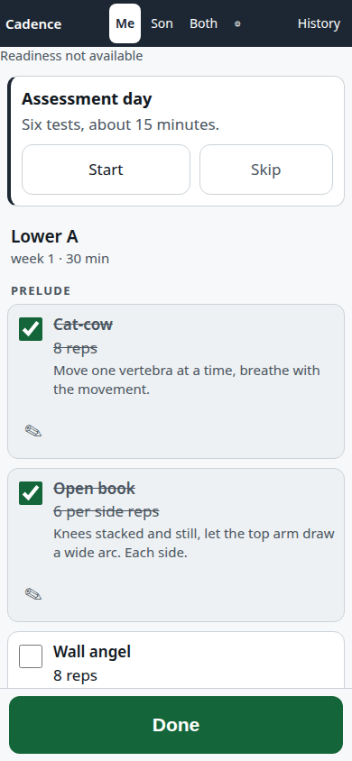

# Cadence — handoff

Written at the close of PRP-10. Read this before touching anything.

> ## Current state — 2026-09-09
>
> **It is built, deployed, and running.** Nothing below is a plan any more.
>
> | | |
> |---|---|
> | Live at | `https://cadence.grepon.cc` (valid cert, ~100 ms) |
> | Running on | VM-201 (`knowledge`), `~/docker/cadence`, container healthy, `restart: unless-stopped` |
> | Published on | `${CADENCE_BIND_ADDR}:8090` = the **Tailscale** address; the LAN cannot reach it (D-257c) |
> | Both integrations | **Connected.** VitalForge reads real body-comp and readiness; OmniRoute sees 1374 models |
> | Write-back | **Complete.** The VitalForge endpoint is merged (PR #42) and live — verified by probe (D-278) |
> | Backups | Nightly 03:17 cron, in-container, verified |
> | Repo | `ventouxlabs/cadence`, 11 PRPs + solo mode, CI green, 3328 tests / 93% coverage |
>
> **Two things differ from what the rest of this document assumes.** The install lives at
> `~/docker/cadence`, not `/opt/cadence` — the host's own convention, matching
> `~/docker/vitalforge` (D-257a). And **the son is currently hidden**: `son_enabled` is off, so
> the tabs read just "Me". None of his data was deleted — his program, all 16 planned sessions
> and his session are intact, and one toggle in Settings brings him back exactly as he was.
> Read "Day one" with that in mind.
>
> **The only thing left for JD:** upload `docs/assets/social-preview.png` at GitHub →
> Settings → General → Social preview. There is no API for it.

## What Cadence is

Cadence is a self-hosted daily workout app for JD and his son: open it, see today's workout as a plain checklist, tick each exercise, hit Done, and the session shows up in VitalForge and, from there, in Garmin Connect as a strength-training activity. It runs as one FastAPI process serving both the HTML UI (Jinja + HTMX, offline-capable PWA) and a JSON API, with a rolling 4-week program built from a data-driven exercise library and youth rules enforced by a validator, not just by convention. Everything is designed around one constraint: usable one-handed, on the floor, by a kid, in under 10 seconds per exercise.



## What shipped, per PRP

| PRP | Tag | What it added |
|---|---|---|
| 00 | `prp-00` | Scaffold, license, schema models, validator, CI, Makefile, health endpoint. |
| 01 | `prp-01` | Exercise/workout library (52 exercises, 11 workouts), loader, 4-week program engine, profile/setting tables, seed. |
| 02 | `prp-02` | Today checklist, tick/adjust/felt, Done + summary, offline queue (IndexedDB), PWA manifest + service worker. |
| 03 | `prp-03` | Setup and Settings screens, age-band youth rules wired end to end, rebuild-on-settings-change. |
| 04 | `prp-04` | History list, weekly scorecard, streak, body-comp trend line (parent only). |
| 05 | `prp-05` | VitalForge-side branch (unpushed, see below): `POST /api/activity` → Garmin `strength_training` activity, idempotent on `session_id`. |
| 06 | `prp-06` | Cadence-side VitalForge client: metrics read + cache, readiness nudge, write-back on Done with a leased retry queue. |
| 07 | `prp-07` | Autoregulation (bump/hold/regress), baseline/retest assessments, gap detection, challenge rows woven into sessions. |
| 08 | `prp-08` | `/api/import`, `/api/generate` via OmniRoute, prompt templates, validator hardening against prompt injection and youth-rule bypass. |
| 09 | `prp-09` | Dockerfile, compose, backup/restore, deploy script, smoke test, VM-201 runbook. |
| 10 | `prp-10` | Son-mode UX pass, badges, low-end Android perf budget, screenshots, this document. |

Full detail per PRP, including reviewer findings and final test counts, is in `docs/BUILD-LOG.md`.

## What was descoped

- **D-071** — `next_time_note` in PRP-02 was a placeholder (three fixed lines keyed on `felt`, nothing numeric). PRP-07 replaced its body with the real autoregulation note once progression state existed to describe.
- **D-166** — Three smoke-script assertions (the real sync line, the metrics 200, and "exactly one activity recorded") waited on PRP-06 and were marked `TODO(PRP-06)` in the interim; a socket-listener probe stood in for the missing mock-recorder check. All three resolved once PRP-06 merged.
- **D-117** — No native Android app. Cadence ships as a PWA only; a Trusted Web Activity wrapper is an optional follow-up (see "Installing as an app" below). Confirmed with JD 2026-09-07.
- **D-007** — The `superpowers` brainstorming skill was skipped for this build. JD forbade questions and approval gates up front; the brief plus `docs/exercise-principles.md` stood in for it, and open questions became settings or `DECISIONS.md` entries instead.
- **D-034** — pre-commit hooks are shipped as config (`.pre-commit-config.yaml`) but not installed on the build workstation. `make lint` is the actual CI gate. Run `uv run pre-commit install` to turn them on locally.
- **D-064** — A seed `workout` row stores the `WorkoutTemplate` document, not a concrete `Workout` dump as the architecture doc originally said — there is no concrete document until a profile and week are applied.
- **D-173** — Import's "use this workout for day-type X" swap writes rows directly rather than routing through the full settings rebuild, because a rebuild can never see a database-only (imported/generated) workout (D-010). A narrower version of what PRP-08 originally scoped out.
- **D-044** — `vitalforge-weight/app.py` sits at ~1400 lines, over the project's own 800-line file ceiling, because the PRP-05 brief named that file by line and location for the new routes and models. Flagged for JD to extract a `shared/activity_api.py` if it becomes unreviewable.
- **§4.1 of `docs/vitalforge-contract.md`, Open Question 1** — the exact JSON keys of the Garmin `exerciseSets` payload were never confirmed against a real account, so PRP-05 shipped the `create_manual_activity`-only path as guaranteed and the per-exercise-set enhancement as best-effort, silently degrading `garmin_sets_status` to `failed` rather than blocking the activity. See the live-probe checklist below.

## Open decisions

These are defaults chosen without asking JD. Each entry below is decision · why · how to change. Full text and consequences for every one are in `docs/DECISIONS.md`; this list is not exhaustive of the file, but covers every entry that is a default rather than a fact.

- **D-009 — No login of its own.** Cadence has no auth; the security boundary is Tailscale (optionally an NPM access list). Why: a login screen makes Today slower for a kid on the floor, and the brief's stated boundary is the homelab. **Change:** add the `CADENCE_ACCESS_TOKEN` middleware sketched in `docs/deploy.md` §9 (~40 lines, reads a bearer header or a cookie set by a one-field `/unlock` page, `hmac.compare_digest`, blank token = disabled).
- **D-015 — Son's Garmin push rides the parent's credential.** VitalForge holds one Garmin login (the parent's). `POST /p/{slug}/api/activity` with `push_to_garmin: true` for the son 409s unless the body also carries `garmin_target: "credential_person"`, which files the activity under the parent's Garmin with the activity name prefixed "(Son)". Cadence sends that field only when the `push_son_to_garmin` setting is on. **Change:** flip `push_son_to_garmin` off in Settings (default off); the real fix — per-person Garmin linking — is VitalForge "Phase 3" and does not exist yet.
- **D-016 — Write-back retry policy.** Exponential backoff 1 min → 2 h, capped at 8 attempts, never retried automatically on 409 or 422. Why: `garminconnect` has no 429 backoff of its own, and a tight retry loop on the shared credential risks an IP block that would also break weight logging. **Change:** `cadence/vitalforge/schedule.py` holds the constants; note that a 404/401/403/missing-token/missing-slug session instead retries forever on the slow 2-hour schedule without spending the budget (D-137), since those are configuration problems, not transient ones.
- **D-018 — `garmin_category: null` means no per-exercise set upload.** `UNKNOWN` is not a real `garminconnect` 0.3.11 category; wherever the exercise principles doc said `UNKNOWN`, the seed YAML uses `null` instead, the activity payload omits `garmin_category` for that exercise, and VitalForge skips the exercise-set upload for it — the activity itself still gets created. **Change:** `library/exercises/*.yaml`, giving the exercise a real category from the confirmed list in `docs/vitalforge-contract.md` §3.1.
- **D-001 — Repo lives under `ventouxlabs`, not `bearyjd`.** Matches the brief's "Ventouxlabs" branding. **Change:** `gh repo transfer`.
- **D-008 — French names for services/modules, English for code identifiers.** Fixed convention, not really open, but nobody confirmed it explicitly beyond the brief's one line. **Change:** none sane; it's baked into every module path.
- **D-036 — Dev port defaults to 8090, not 8000.** An unrelated process holds 127.0.0.1:8000 on JD's workstation. **Change:** `CADENCE_PORT` in `.env`.
- **D-069 (confirmed, listed for completeness) — the son has no Garmin account.** His sessions live in VitalForge under his own slug and never reach Garmin unless `push_son_to_garmin` is on. Confirmed with JD 2026-09-06, not actually open, but interacts directly with D-015 and D-018 above.
- **D-090 — `display_unit` (kg/lb) defaults to kg.** Storage is always kilograms; conversion happens in exactly one place (`format_load` in `cadence/web/rendering.py`). **Change:** the Settings screen; nothing else needs to know.
- **D-161 — Deploy defaults to rsync mode, not git.** Because PRP-05's VitalForge branch is deliberately never pushed (D-005), a git-only deploy can't carry the tree write-back is tested against. **Change:** `make deploy DEPLOY_MODE=git`, once a real remote and branch exist on the VM.
- **D-206 — The published port binds `0.0.0.0` by default.** Closing the LAN bypass of the NPM access list is one operator step, not shipped by default. **Already taken on VM-201:** `CADENCE_BIND_ADDR=100.74.76.39` is set in `~/docker/cadence/.env` and verified (D-257c), so the LAN cannot reach the port. The default in the repo stays `0.0.0.0`, because a Tailscale address is machine-specific and cannot be committed — so a *fresh* install starts wide and closes it the same way. NPM's Forward Hostname must name the same address the bind does, or the proxy 502s (`docs/deploy.md` §4).
- **D-117 — PWA-only, no native app; TWA wrapper is optional.** Confirmed with JD 2026-09-07. See "Installing as an app" below for the change path.
- **D-005 — VitalForge branch never pushed.** A deliberate default so JD can review before it touches his real VitalForge remote. **Change:** see the section below.

## The VitalForge branch to review

> **Done — merged and live as of 2026-09-09.** JD reviewed and merged it as PR #42, with two
> follow-up fixes on top (`cb529e6` normalising non-calendar ISO dates and pinning the pushed
> activity name; `8626670` making the activity-name lookup total). The endpoint is on VitalForge
> `main` and running on VM-201: `POST /p/{slug}/api/activity` answers `401` unauthenticated
> rather than `404`, and an authenticated store-only probe from Cadence's container returned
> `202` with `garmin_status: "skipped"`. **The write-back path is complete end to end.** The rest
> of this section is kept as the record of what was handed over; the branch names below are
> historical.

The Garmin write-back endpoint was developed on a branch in the sibling VitalForge checkout, **not** in this repo: `../vitalforge`, branch `cadence/activity-endpoint`, cut from `fix/a6-review-followups` (D-020 — that's the tree the contract's citations and the `should_attempt_garmin_push` helper live in). It was deliberately never pushed by the build (D-005) — JD reviewed and merged it himself.

It adds `POST /p/{slug}/api/activity`: given a completed Cadence session, it stores it in a new `strength_sessions` table and creates a `strength_training` activity in Garmin via `garminconnect`'s `create_manual_activity`, with a best-effort per-exercise-set enhancement via `set_activity_exercise_sets`. It's idempotent on `session_id` — a repeat POST never creates a second Garmin activity — and refuses (409) a push for a person who isn't the Garmin-credential person, unless the body explicitly carries `garmin_target: "credential_person"` (the D-015 son-push path). It also adds two read routes: `GET /p/{slug}/api/activity/{session_id}` and `GET /p/{slug}/api/strength-sessions`.

To read it:

```bash
git -C ../vitalforge log --oneline fix/a6-review-followups..cadence/activity-endpoint
git -C ../vitalforge diff fix/a6-review-followups..cadence/activity-endpoint --stat
git -C ../vitalforge diff fix/a6-review-followups..cadence/activity-endpoint -- vitalforge-weight/app.py
git -C ../vitalforge diff fix/a6-review-followups..cadence/activity-endpoint -- shared/garmin_client.py
```

That range is **10 commits** — what this PRP added and nothing else. Use it rather than `main..`,
which shows **12**: the base branch `fix/a6-review-followups` is itself unmerged, so two commits
that are not this PRP's work sit between it and `main` (D-252). To see those two on their own:

```bash
git -C ../vitalforge log --oneline main..fix/a6-review-followups
```

### Live-probe checklist (from `docs/vitalforge-contract.md` §5)

Four things can only be confirmed against a real Garmin account — nothing in the `garminconnect` 0.3.11 source or its metadata settles them, and they were shipped as documented risks rather than blockers:

1. **The `exerciseSets` payload's exact JSON keys are unverified.** Neither the library nor its metadata documents them. Before trusting the per-exercise-set enhancement path, find an existing strength activity on the real account and call `get_activity_exercise_sets(activity_id)` to see the real shape — the `set_...` docstring says the request takes the same shape as the response, so that one call settles it.
2. **Whether Garmin accepts exercise sets on a manually created activity at all.** Garmin may only accept them on activities that arrived with FIT set data. If not, the fallback (generating a real FIT file and using `upload_activity`) is much larger work — the DB already tracks this as a `garmin_sets_status` value (`not_attempted`/`synced`/`failed`), not an architectural assumption, so a "no" here degrades gracefully rather than breaking anything.
3. **Whether `"strength_training"` is a valid activity `typeKey`.** It's confirmed only as a *workout* `sportTypeKey`, not an activity one. Resolve with one live call to `client.get_activity_types()` and pin the answer in a test.
4. **Whether `create_manual_activity`'s return value is the new activity id, and under which key.** The two-step design (create, then enhance) depends on getting an id back from the first call. `get_last_activity()` exists as a fallback but is racy and should stay a documented fallback, not the primary path.

## Deploy to VM-201

Commands below are quoted verbatim from `docs/deploy.md`; that document is the source of truth and owns anything not reproduced here (troubleshooting table, rollback, NPM access-list steps).

> **Two substitutions before you run any of it, both because the live install differs from the
> document it was written from.** They are named at the top of this file too; they are repeated
> here because this is where somebody copy-pastes.
>
> - **The install is at `~/docker/cadence`, not `/opt/cadence`.** The host's own convention won
>   (D-257a). The commands below name the real path directly rather than asking you to
>   substitute it — that habit is what D-280 and D-281 cost. Spelled absolutely, because
>   `scripts/deploy.sh` refuses a path that does not start with `/`, and it **refuses a path that
>   does not exist** rather than creating one (D-281): the `mkdir` below is a deliberate step.
> - **The published port is not on the LAN.** `CADENCE_BIND_ADDR=100.74.76.39` — VM-201's
>   Tailscale address (D-257c) — so `192.168.1.21:8090` refuses, and any health check written
>   against it fails in a way that reads like a container that never started.

Prerequisites: Docker Engine + Compose plugin on VM-201; an ssh alias `vm-201` with key auth from the workstation; **passwordless sudo** for the deploying user on VM-201 (the deploy runs one `sudo chown` over a non-interactive ssh — a password prompt there hangs it); `rsync` and `jq` on the workstation.

First deploy — order matters, because `env_file: .env` makes Compose refuse to start without it, so the first `make deploy` is expected to fail at `up`:

```bash
# On VM-201, once. The deploy will not create this for you (D-281).
sudo mkdir -p /home/user/docker/cadence && sudo chown "$USER" /home/user/docker/cadence
```

```bash
# 1. Workstation - ships the tree, then stops at `up` with a missing .env
CADENCE_DEPLOY_PATH=/home/user/docker/cadence make deploy

# 2. VM-201, once: create .env from the committed template and fill in the real tokens
cd /home/user/docker/cadence
cp .env.example .env
chmod 600 .env
${EDITOR:-nano} .env                # VITALFORGE_TOKEN, OMNIROUTE_KEY, the two person slugs

# 3. Workstation - now it completes
CADENCE_DEPLOY_PATH=/home/user/docker/cadence make deploy
```

`.env` keys to fill (never a real value in this repo or in `.env.example` — it ships blank):

| Key | Fill with |
|---|---|
| `VITALFORGE_TOKEN` | A bearer token minted via VitalForge's `POST /auth/tokens` |
| `VITALFORGE_PERSON_ME` | JD's VitalForge person slug |
| `VITALFORGE_PERSON_SON` | The son's VitalForge person slug |
| `OMNIROUTE_KEY` | The OmniRoute gateway key |
| `TZ` | Defaults to `Europe/Paris` in the base compose file; override if wrong |

Seed the library and two profiles on first boot:

```bash
docker compose exec cadence python -m cadence.bibliotheque.seed
```

Confirm before touching Nginx Proxy Manager:

```bash
docker compose ps                            # STATUS must say (healthy), not just Up
docker exec cadence id -u                    # 10001
docker compose port cadence 8000             # the address:port the publish actually landed on
curl -s "http://$(docker compose port cadence 8000)/api/health" | jq .
```

`docker compose port` rather than a hardcoded host, for the reason in the callout above: the
publish follows `CADENCE_BIND_ADDR`, and asking it where it is works on both binds.

Routine deploys after that:

```bash
# rsync mode (default) — ships the working tree, unpushed branches included.
CADENCE_DEPLOY_PATH=/home/user/docker/cadence make deploy

# git mode — `git pull --ff-only` on the VM instead; needs a clone at that path.
CADENCE_DEPLOY_PATH=/home/user/docker/cadence make deploy DEPLOY_MODE=git

make smoke BASE=https://cadence.grepon.cc
```

A bare `make deploy` uses the script's own default, `/opt/cadence`, which is not this install —
the whole of D-281. It now refuses rather than building a second one, but the deploy you wanted
still has not happened, so name the path every time.

**Healthcheck to watch:** `docker compose ps` must report `(healthy)`, not just `Up` — Docker's restart policy only acts on process exit, never on a failing healthcheck, so an unhealthy-but-running container keeps serving traffic silently. `docker inspect --format '{{json .State.Health}}' cadence | jq .` shows the last output. Never run a bare `docker inspect cadence` — it prints `Config.Env` in full, including both secrets.

## Day one

> **As deployed, steps 1 and 2 are already done** and the son is hidden (`son_enabled` off), so
> step 3's `?profile=son` and the son half of step 4 do not apply until you turn him back on in
> Settings. Everything else stands. Kept in full because it is the procedure for a fresh install,
> and for the day he joins.

1. **Run setup.** Visit `/setup` (or just `/` on a fresh, unseeded install — it redirects until `setup_complete`). Fill in equipment, weights available, days per week, session length.
2. **Set the son's age.** Same `/setup` screen — his age drives which youth band (under-10, 10–13, 14–17) his program uses; until it's set he gets the strictest band by default. Editable later at `/settings`. *(Only relevant once `son_enabled` is on; while he is hidden the field is not shown.)*
3. **Do the baseline assessment.** Visit `/assess?profile=son` (and `/assess?profile=me` for JD) and run the six-test battery: push-up max, dead hang, plank, wall-angel reach, goblet squat quality (self-rated), farmer-carry time. This seeds the gap/challenge system.
4. **Do the first session.** Visit `/today?profile=me`, `/today?profile=son`, or `/today?profile=together` for both on one screen. Tick rows, use the felt toggle once all rows are done, hit Done.
5. **Check it landed.** The Done screen (`/done/{session_id}`) shows the sync status line — `synced ✓`, `will sync`, or a retry-with-reason line. Then confirm in VitalForge (the person's page under `/p/{slug}/`) and, if `push_to_garmin` was on for that session, in Garmin Connect as a new strength-training activity.

## Where things live

The module map, from `docs/architecture.md` §2. French names for the project, services, containers, and top-level domain modules; English identifiers everywhere else so the API lines up with VitalForge and Garmin.

| Module | Purpose |
|---|---|
| `cadence/schema/` | Pydantic v2 models — the library DSL (`Exercise`, `Workout`, `Row`, `Progression`, `YouthRuleSet`, `AssessmentSpec`). |
| `cadence/validateur/` | The validator: schema checks, equipment whitelist, youth rules, per-profile checks. The single gate every workout (seed, imported, or generated) must pass. |
| `cadence/bibliotheque/` | Library loader (YAML → DB), lookup, and the import service. |
| `cadence/programme/` | The 4-week program builder, day templates, autoregulation, deload, load rounding/ladders. |
| `cadence/profils/` | Profile and Setting tables, age bands, setup/settings services. |
| `cadence/seance/` | Today resolution, ticks, adjust, Done, session/row tables, summaries. |
| `cadence/historique/` | History queries, weekly scorecard, streak. |
| `cadence/bilan/` | Assessments, gap detection, challenges. |
| `cadence/ia/` | OmniRoute client, prompt templates, the generate service. |
| `cadence/vitalforge/` | Client (read metrics, POST activity), `metrics_cache`, the sync/retry queue. |
| `cadence/web/` | Routers for HTML pages and HTMX partials; `templates/`; `static/` (vendored HTMX, manifest, service worker). |
| `cadence/api/` | JSON routers: health, today, sessions, settings, profiles, import, generate, metrics, sync, assessments. |

## Known limitations

- **Carry rows are tick-only** (PRP-02). A farmer-carry or similar row has no separate reps/load adjust path beyond the tick — its "adjust" affordance doesn't exist yet.
- **Generated workouts are stored but not auto-scheduled** (PRP-08). `/api/generate/accept` writes the workout to the DB; nothing wires it into a profile's rolling plan automatically. Assigning it to a day is the "use for [day type]" adoption flow in PRP-08/PRP-10, which is manual.
- **The son's readiness nudge is permanently null.** The deployment holds one Garmin credential (the parent's), and the son has no Garmin account, so VitalForge's readiness endpoint returns `insufficient_data` for him forever (`docs/vitalforge-contract.md` §2.3, D-069). The nudge renders as "not available" rather than erroring or coercing to a number — this is by design, not a bug to fix.
- **The son's body-composition gap check can't fire in practice.** Autoregulation's `body_comp` gap rule reads a derived `muscle_pct` series that only exists for whichever profile has real Garmin body-composition data — i.e., never the son's (D-219d/D-220).
- ~~The VitalForge write-back endpoint is not yet deployed.~~ **Resolved 2026-09-09** — merged as PR #42 and live on VM-201, verified by probe (D-278). Write-back works end to end. The one path still unproven by any automated check is the last hop: a real session producing a real activity in Garmin Connect, because that ends in an irreversible write to JD's account. Do one workout and confirm it appears.
- **The son is hidden right now** (`son_enabled` off, D-260..D-276). His data is untouched and one Settings toggle restores it. While hidden, his four-weekly retest is not queued and his sessions are not created — he simply produces nothing new (D-270).
- **No authentication.** Anything that can reach `cadence.grepon.cc` can read both profiles and write sessions (D-009). The Tailscale boundary plus an optional NPM access list is the only guard shipped.
- **A session with no warm-up row can never earn the warm-up badge** (D-231). `prelude-4-weeks` requires each qualifying session to carry at least one prelude row, because "every prelude row is ticked" is otherwise trivially true of a session with none. Every session the program engine builds has a prelude (D-051), so this only bites an imported or hand-written workout that dropped it — and there the badge staying unearned is the honest answer, not a bug.
- ~~The "challenge met" badge shows no date~~ **Resolved 2026-09-11** (D-232). `challenge.met_on` exists, `close_met` sets it to the `recorded_on` of the retest that reached the target — the day it happened, not the day it was typed in — and the badge names it: "Challenge met · earned 22 Mar". One thing carries forward: **a challenge already `met` on the deployed database has no `met_on` and never will.** There is no migration runner, so the column arrives on new databases through `create_all` and is simply absent on the old one; the badge asks `has_column` first and falls back to the dateless "Challenge met · earned" rather than raising `no such column` on every History render. Both halves are mutation-checked.
- **Badges are recomputed from scratch on every read, so they are not monotonic** (D-248). "Complete" is judged against the age band the profile carries *now*, and the band threshold rises from 3 ticked rows to 4 at fourteen — so a birthday can turn a past three-row session partial and un-earn `first-session` or `sessions-10`. Storing an earned floor is what PRP-10 forbids outright (badges are derived, never stored), so this is a known and accepted edge rather than an oversight. Going the other way, youth to adult, only ever adds badges.
- **Pounds display only converts at render time.** Everything is stored in kilograms; a `display_unit` bug would only ever be in `format_load` (`cadence/web/rendering.py`), which is good, but also means there's exactly one code path responsible for every number a parent or a child sees.

## Installing as an app

Cadence ships as a **PWA only** — there is no native Android app, and none is planned for this build (D-117).

**What ships (the real path):** open `https://cadence.grepon.cc` in Chrome on the son's or JD's Android phone, over Tailscale. Tap the menu (⋮) → **Add to Home screen** → Install. It installs standalone (no browser chrome), Today is cached for offline use by the service worker, and ticks made offline queue in IndexedDB and replay to the server once back online. On iOS, the equivalent is Safari's Share sheet → **Add to Home Screen**.

**Optional follow-up, not part of this build:** a Trusted Web Activity (TWA) wrapper — built with PWABuilder or Bubblewrap — produces a sideloadable APK that opens the same PWA in a chromeless Custom Tab, which is the closest thing to a "real app" without writing native Android code. It requires HTTPS already working on `cadence.grepon.cc` (it does) and a `/.well-known/assetlinks.json` file on that domain proving the APK and the site are controlled by the same party (Digital Asset Links). Nothing here blocks it; it's simply out of scope for this PRP set, and the PWA path above is what actually ships.
